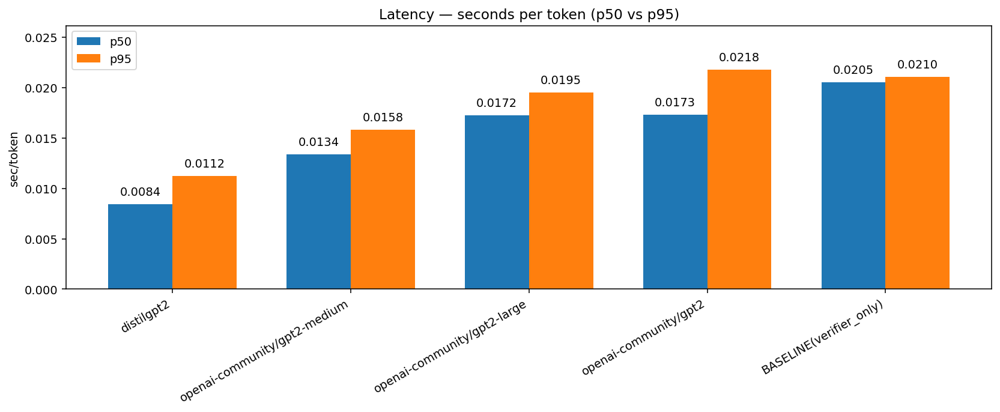
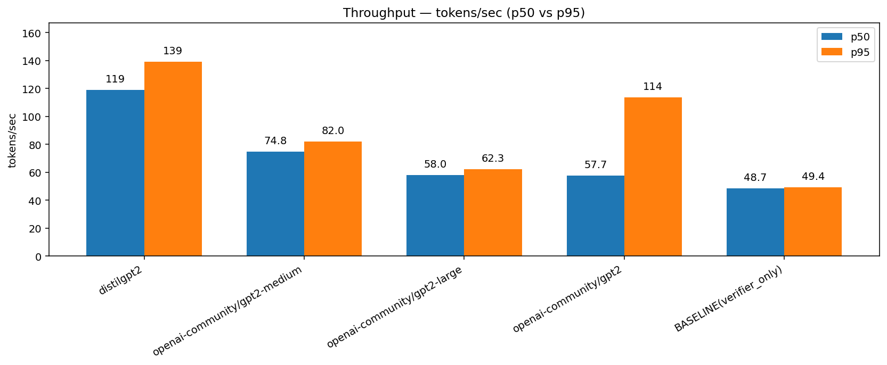
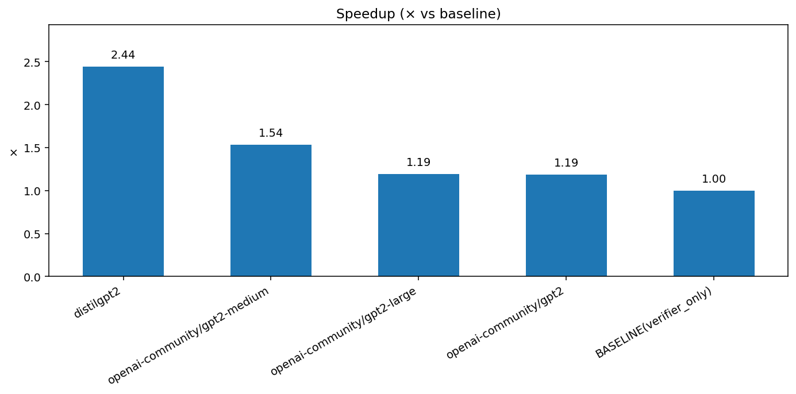
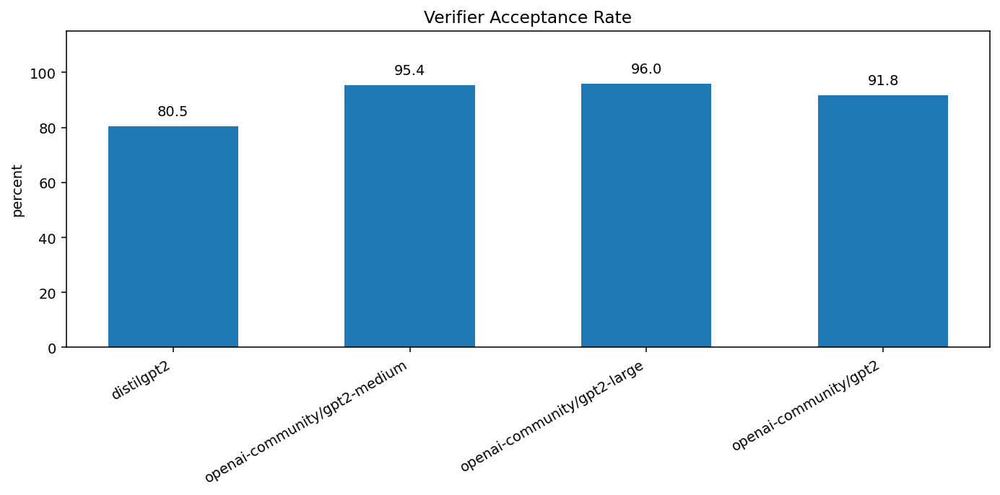

# Speculative Decoding for PubMedQA

> Speculative Decoding provides **2–3× faster LLM inference** with draft–verifier decoding while preserving verifier-level quality with the PubMedQA dataset.


## Inspiration
Running LLM inference locally on my Mac (MPS/CPU) is **slow and costly** where each token required a full forward pass. **Speculative decoding** offered a way to **speed up inference** by letting small draft models propose tokens and a large verifier check them in batches. This project taught me both about LLM acceleration and using cloud GPUs (Vast.ai) for real-world deployments.


## Introduction
Large Language Models (LLMs) power apps in customer support, healthcare, and enterprise search. But, **each token → a full pass of a big model → high latency & high cost**. This makes real-time interactions hard to scale.

Speculative decoding solves this using **small draft models** to propose token candidate blocks (short sequence of 4–8 tokens) proposed at once which is fast and cheap for the verifier and a **large verifier model** to approve/reject these blocks. An analogis is that drafts are like interns proposing answers and verifiers are like managers that approve or reject. The manager doesnt have to write the answers themselves, it just checks.

The benefits are **lower latency**, **reduced cost per query**, **higher throughput** (serve more users per GPU), **same quality as baseline** (verifier is final authority). 

## Dataset (PubMedQA)
This project uses the PubMedQA dataset (questions + abstracts) to test speculative decoding.   In this setup, small GPT-2 family models (`distilgpt2`, `gpt2`, `gpt2-medium`, `gpt2-large`) act as drafts, while the larger `gpt2-xl` serves as the verifier that validates draft proposals.

**Question:**  
*What are common first-line treatments for non-small cell lung cancer (NSCLC)?*

**Draft Block:**  
`["First-line", "treatment", "often", "includes", "surgery"]` → ✔ accepted  

**Next Block (bad draft):**  
`["and", "aspirin", "for", "early-stage", "disease"]` → ✘ rejected at “aspirin” → replaced with “chemotherapy”  

**Answer grows:**  
*“First-line treatment often includes surgery and chemotherapy …”*  

Process repeats until EOS token → then move to the next QA pair.


## Models

All models are from the **GPT-2 family** (shared tokenizer ensures alignment).

| Role      | Model ID                       | Params | Notes                          |
|-----------|--------------------------------|--------|--------------------------------|
| Draft     | distilgpt2                     | ~82M   | Fastest, biggest speedup       |
| Draft     | openai-community/gpt2          | ~124M  | Baseline GPT-2                 |
| Draft     | openai-community/gpt2-medium   | ~355M  | Balanced                       |
| Draft     | openai-community/gpt2-large    | ~774M  | High acceptance, slower        |
| Verifier  | openai-community/gpt2-xl       | ~1.5B  | Final authority, baseline-only |

## Workflow

```text
Dataset (PubMed QA: Questions + Abstracts)
        │
Draft Models (distilgpt2, gpt2, gpt2-medium, gpt2-large)
        │  → propose k tokens
Verifier Model (gpt2-xl)
        │  → accepts/rejects
Metrics Logging (latency, throughput, acceptance, speedup)
        │
Outputs (CSV tables, plots, JSON logs)
```

## Metrics

- **Latency (p50/p95):** time per token  
- **Throughput (p50/95):** tokens generated per second  
- **Speedup (×):** vs verifier-only baseline  
- **Acceptance Rate (%):** % draft tokens accepted by verifier  


## Results: Table

| Model                | Latency p50 (s/token) | Throughput p50 (tok/s) | Speedup (×) | Acceptance (%) |
|-----------------------|-----------------------|-------------------------|-------------|----------------|
| distilgpt2            | 0.0084               | 118.9                  | **2.44×**   | ~80%           |
| gpt2-medium           | 0.0134               | 74.8                   | 1.54×       | ~95%           |
| gpt2-large            | 0.0172               | 58.0                   | 1.19×       | ~96%           |
| gpt2 (small)          | 0.0173               | 57.7                   | 1.19×       | ~92%           |
| Baseline (gpt2-xl)    | 0.0205               | 48.7                   | 1.00×       | N/A            |

*Smaller drafts deliver the largest speedups but come with lower acceptance rates, while larger drafts achieve higher acceptance but only modest efficiency gains. Overall, `distilgpt2` strikes the best balance, offering the strongest acceleration without overly sacrificing fidelity. Shown are the p50, see README.report.md for full report* 

## Results: Plots

  
    *Median (p50) and tail (p95) latency per token. Draft models significantly reduce latency compared to the baseline verifier-only run. The smallest draft, `distilgpt2`, cuts latency by more than half, showing speculative decoding’s strongest gains in responsiveness.*  
  


  
    *Tokens generated per second. Throughput more than doubles when using smaller drafts like `distilgpt2`, allowing far more queries to be served per second. As draft size increases, throughput improvements taper off, but all drafts outperform the baseline.*  
  

  
    *Relative speedup compared to the verifier-only baseline. `distilgpt2` achieves the highest acceleration (~2.4×), while medium and large drafts show smaller but consistent gains. This demonstrates the trade-off between draft size and efficiency benefits.*  
  

  
    *Percentage of draft tokens accepted by the verifier. Larger drafts such as `gpt2-medium` and `gpt2-large` align closely with the verifier (≈95–96%), while `distilgpt2` has lower acceptance (~80%) but still provides strong speed improvements. The chart highlights the balance between speed (small drafts) and fidelity (large drafts).*  

## Next Steps
- **Scale to larger datasets:** Use bigger body of corpus such as CORD-19 to test performance at scale.  
- **Use larger verifier models:** Replace verifier `GPT-2 XL` with modern LLMs (e.g.,`LLaMA-2`) to evaluate speculative decoding against stronger baselines.  
- **Stress-test real-world applications:** Apply speculative decoding in different domains such as biopharm, EHR, or genomes.  


## Conclusion
This project shows that speculative decoding makes LLMs **2–3× faster** while preserving verifier-level accuracy. By combining small draft models for speed with a large verifier model for correctness, we **reduced latency, cost per query, and GPU load** without sacrificing quality. This approach unlocks real-time, scalable applications where both speed and accuracy are critical.

## Tech Stack
Python, PyTorch, Hugging Face Transformers, pandas, numpy, matplotlib, PyYAML, Cloud GPUs (Vast.ai)
